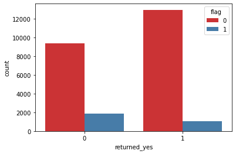
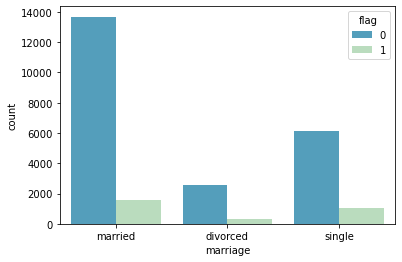
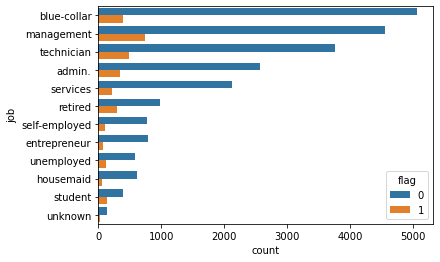
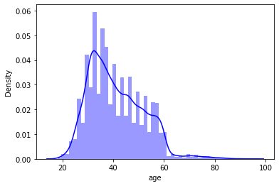

# Background 
<div align = center>


</div>

Tmall.com (simplified Chinese: 天猫; pinyin: Tiānmāo), formerly Taobao Mall, is a Chinese-language website for business-to-consumer (B2C) online retail, operated in China by Alibaba Group. 

It is a platform for Chinese people and international businesses to sell brand-name goods to consumers. 

In the last few years, it has opened its features to brands, not only for online sales but also for developing brand awareness.


ANT credit pay is a consumer credit product launched by ANT Financial, which can be used in Alipay consumption, and has similar functions to credit cards. 

ANT credit pay will provide users with credit ranging from RMB 1,000 to RMB 50,000 according to their consumption levels and credit scores. 


# Analysis goal 
Based on user data and consumer behavior data 
- build a classification model and perform logistic regression.
- predict which customer group has a higer probability of using coupons. 


# 1 Data analysis 
## 1.1 Index explanation 
- id 
- age 
- job 
- marriage 
- default: if there is a breach of contact 
- returned: if there is returning the goods 
- loan: pay with ANT Credit pay 
- coupon_used_in_last_6month
- coupon_used_in_last_month
- coupon_ind: if using coupon in the purchase

## 1.2 Clean data
- change categorical variables: default, returned and loan to numercical varaibles, rename to coupon1
- concat coupon and coupon1
```
coupon = pd.concat([coupon, coupon1], axis = 1)
```
- remove 'ID', 'default', 'default_no', 'returned', 'returned_no', 'loan' and 'loan_no' columns
- rename coupon_ind to flag

# 2 Univariate analysis
* 2.1 Observe balance of 'flag' samples 0 and 1
- * In the binary classification problem, the proportion of 0 and 1 should be balanced, and in actual situations it should not be less than 0.05, otherwise it will affect the prediction of the model.
- * The proportions of 0 and 1 in this data set are both higher than 0.05, so the distribution is reasonable.

* 2.2 Observe the mean value
* 2.3 Visualization



- * Compared with customers who have not returned goods, customers who return goods are less likely to use coupons.



- * Married customers are slightly more likely to use coupons than unmarried and divorced customers.
- * Married people have a higher probability of not using coupons than unmarried people.



- * Customers whose job title are management, technician, blue-collar are more likely to use coupon.



- * The data shows that the customer cluster with a higher probability of using coupons is 40 years old.
- * It is found that age > 60 years old has fewer extreme values, but they affect the overall data distribution, and these needs to be excluded from the scope of analysis. 


# 3 Revlevant and visualization 

# 4 Establish and evaluate logistic regression model 


# 5 Summary 


